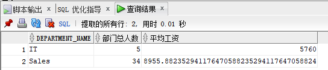
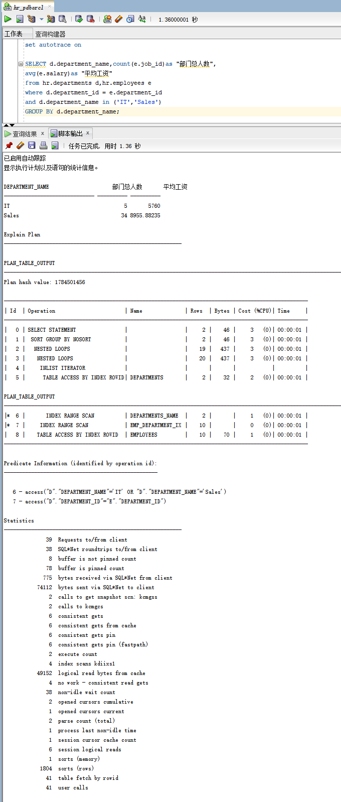
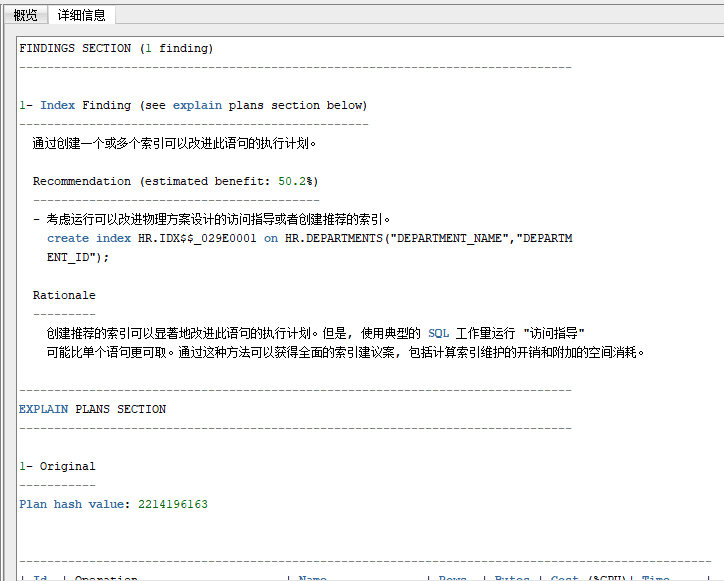
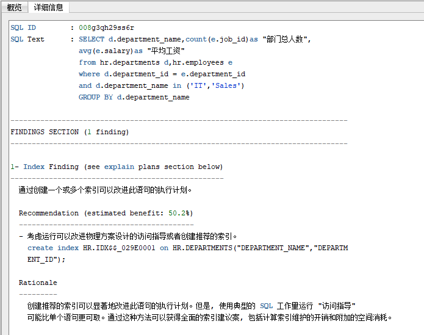
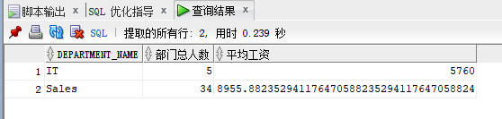
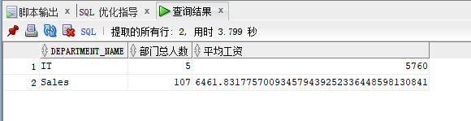
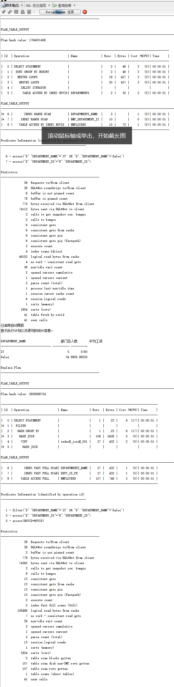
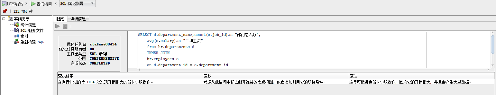

# 实验1：SQL语句的执行计划分析与优化指导

### 姓名：马雪冬           学号：201810414119            班级：18软工1班

## 实验目的

分析SQL执行计划，执行SQL语句的优化指导。理解分析SQL语句的执行计划的重要作用。

## 实验内容

- 对Oracle12c中的HR人力资源管理系统中的表进行查询与分析。
- 首先运行和分析教材中的样例：本训练任务目的是查询两个部门('IT'和'Sales')的部门总人数和平均工资，以下两个查询的结果是一样的。但效率不相同。
- 设计自己的查询语句，并作相应的分析，查询语句不能太简单。

### 执行查询1：

```sql
set autotrace on

SELECT d.department_name,count(e.job_id)as "部门总人数",
avg(e.salary)as "平均工资"
from hr.departments d,hr.employees e
where d.department_id = e.department_id
and d.department_name in ('IT','Sales')
GROUP BY d.department_name;
```

#### 查询结果



#### 脚本输出



#### SQL优化指导


##### 详细信息



##### 优化后



### 执行查询2：

```sql
set autotrace on

SELECT d.department_name,count(e.job_id)as "部门总人数",
avg(e.salary)as "平均工资"
FROM hr.departments d,hr.employees e
WHERE d.department_id = e.department_id
GROUP BY d.department_name
HAVING d.department_name in ('IT','Sales');
```

#### 查询结果



#### 脚本输出


### SQL1与SQL2对比

Cost=6,Rows=106,Predicate Information(谓词信息)中有两次索引搜索access，一次全表搜索filter；相比较而言查询1的Cost，Rows，consistent gets均比查询2要优，所以查询1要优于查询2。

### 自己的SQL语句

```sql
SELECT d.department_name,count(e.job_id)as "部门总人数",
	avg(e.salary)as "平均工资"
	from hr.departments d
    INNER JOIN
    hr.employees e
	on d.department_id = e.department_id
	and d.department_name='IT'
    OR  d.department_name='Sales'
	GROUP BY d.department_name;
```

#### 查询结果



#### 脚本输出



#### SQL优化指导

