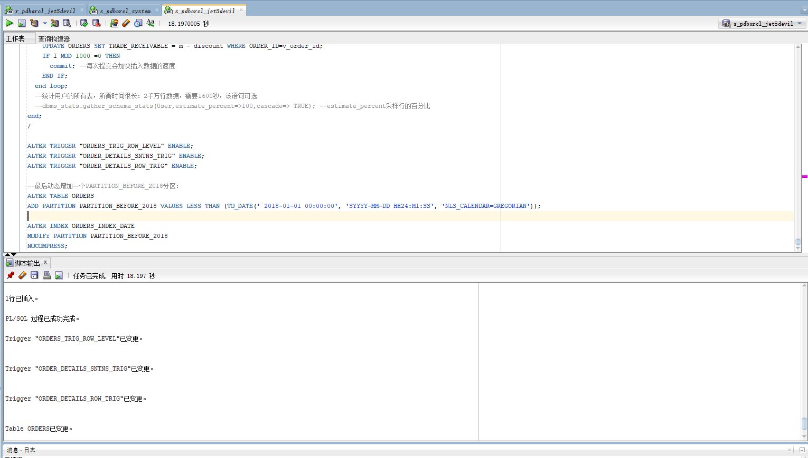
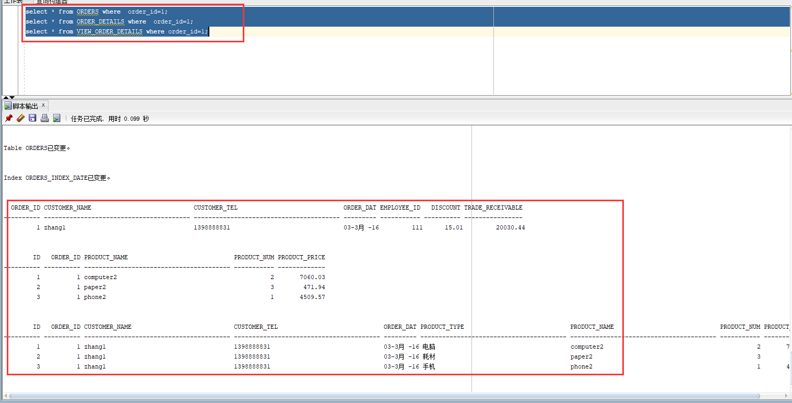
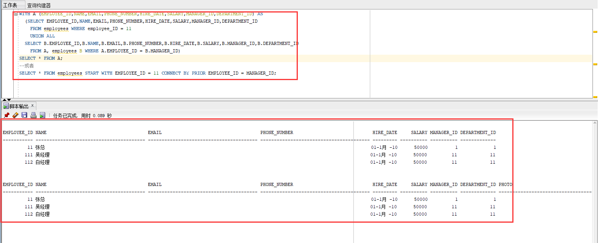
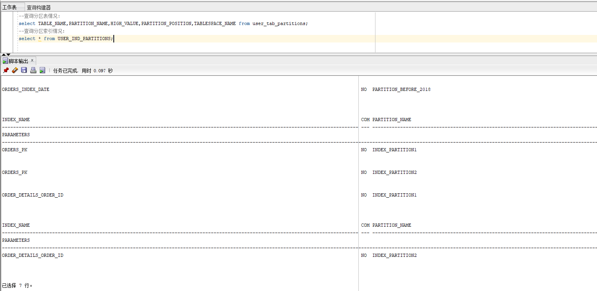
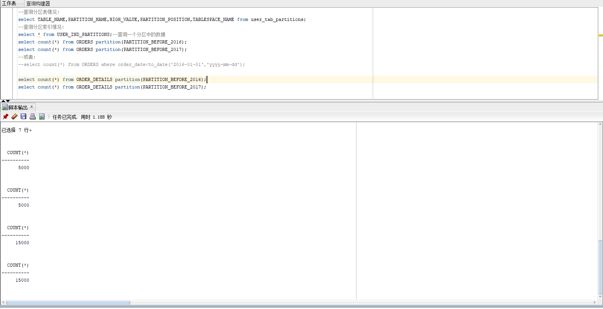
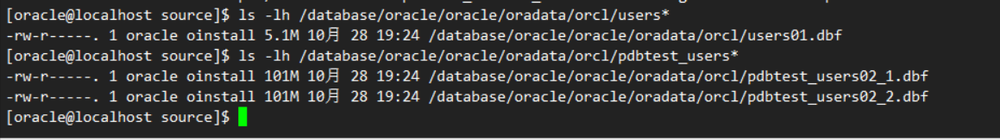

# 实验四：对象管理

# 表空间
创建表空间
```sql
Create Tablespace Users02
datafile
'/database/oracle/oracle/oradata/orcl/pdbtest_users02_1.dbf'
  SIZE 100M AUTOEXTEND ON NEXT 256M MAXSIZE UNLIMITED,
'/database/oracle/oracle/oradata/orcl/pdbtest_users02_2.dbf'
  SIZE 100M AUTOEXTEND ON NEXT 256M MAXSIZE UNLIMITED
EXTENT MANAGEMENT LOCAL SEGMENT SPACE MANAGEMENT AUTO;
```
查看数据空中的表空间
```sql
SYSTEM@192.168.44.183:1521/orclpdb>select tablespace_name, status, contents from dba_tablespaces;

TABLESPACE_NAME 	       STATUS	 CONTENTS
------------------------------ --------- ---------------------
SYSTEM			       ONLINE	 PERMANENT
SYSAUX			       ONLINE	 PERMANENT
UNDOTBS1		       ONLINE	 UNDO
TEMP			       ONLINE	 TEMPORARY
USERS			       ONLINE	 PERMANENT
HR			       ONLINE	 PERMANENT
EXAMPLE 		       ONLINE	 PERMANENT
USERS02 		       ONLINE	 PERMANENT
USERS03 		       ONLINE	 PERMANENT

已选择 9 行。
```

# 用户授权
我数据里面已经有了用户jet5devil，这里不在重新创建用户，创建使用`alter user 用户名 identified by 密码`，继续使用这个用户来进行一下实验，授权到该用户
```sql
SYSTEM@192.168.44.183:1521/orclpdb>alter user jet5devil identified by jet5devil default tablespace "USERS" temporary tablespace "TEMP";

用户已更改。

SYSTEM@192.168.44.183:1521/orclpdb>alter user jet5devil quota unlimited on USERS;

用户已更改。

SYSTEM@192.168.44.183:1521/orclpdb>alter user jet5devil quota unlimited on USERS02;

用户已更改。

SYSTEM@192.168.44.183:1521/orclpdb>alter user jet5devil account unlock;

用户已更改。
SYSTEM@192.168.44.183:1521/orclpdb>grant "CONNECT" to jet5devil with admin option;

授权成功。

SYSTEM@192.168.44.183:1521/orclpdb>grant "RESOURCE" to jet5devil with admin option;

授权成功。

SYSTEM@192.168.44.183:1521/orclpdb>alter user jet5devil default role "CONNECT", "RESOURCE";

用户已更改。

SYSTEM@192.168.44.183:1521/orclpdb>grant create  view to jet5devil with admin option;

授权成功。

```

# 删除表和序列并创建相应的表
这里我创建一个叫做 test4.sql 的文件，在数据库中执行，进行对表的操作。
> 注释：由于一些问题，未能在命令行中执行，后面在sql developer中执行创建表的过程。

截取一些结果图片：
- 表创建正确：

# 执行一些sql语句


- 递归查询某个员工及其所有下属，子下属员工。


- 特殊查询语句和查询分区索引情况：

- 查询一个分区中的数据


查看文件大小
