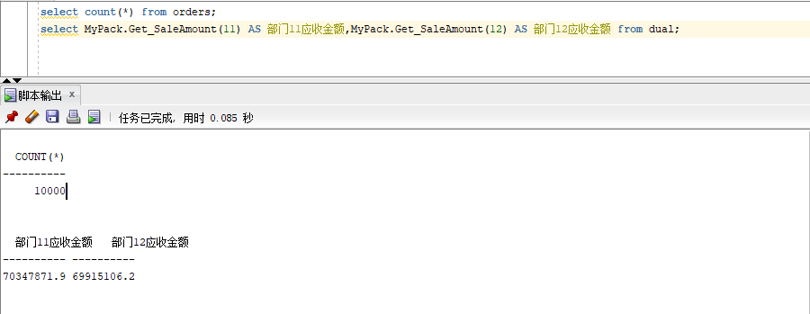
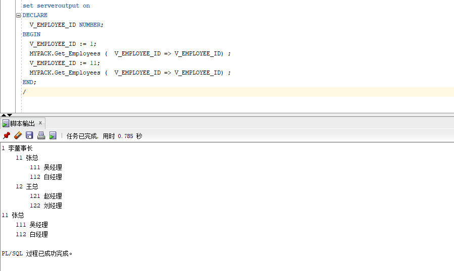

# 实验5 PL/SQL编程

本实验的主要内容为：创建一个包package，报名叫做MyPack，在MyPack中创建一个函数SaleAmount，查询部门表，统计每个部门的销售总金额，每个部门的销售总金额是由该部门的员工（orders.employee_id)完成的销售额之和，函数SaleAmount要求输入的参数是部门号，输出部门的销售金额。
在MyPack中创建一个过程，在其中使用游标，递归查询每个员工及其下属，子下属员工，过程的数据参数是员工工号，输出员工的id姓名，销售总金额，信息用dbms_output包中的put或者put_line函数，输出的员工信息用加空格的多少表示员工的层次
由于订单只是按日期分区的，上述统计时全表搜索，因此统计速度会很慢，如何提高统计的速度呢?


# 创建函数和存储过程
需要创建一个函数叫SaleAmount，返回一个数字，定义一个变量N,将冲orders和employees中查出来的数据保存到变量n里面，最后返回n。 
```sql
create or replace PACKAGE MyPack IS
  FUNCTION Get_SaleAmount(V_DEPARTMENT_ID NUMBER) RETURN NUMBER;
  PROCEDURE Get_Employees(V_EMPLOYEE_ID NUMBER);
END MyPack;
/
create or replace PACKAGE BODY MyPack IS
  FUNCTION Get_SaleAmount(V_DEPARTMENT_ID NUMBER) RETURN NUMBER
  AS
    N NUMBER(20,2); --注意，订单ORDERS.TRADE_RECEIVABLE的类型是NUMBER(8,2),汇总之后，数据要大得多。
    BEGIN
      SELECT SUM(O.TRADE_RECEIVABLE) into N  FROM ORDERS O,EMPLOYEES E
      WHERE O.EMPLOYEE_ID=E.EMPLOYEE_ID AND E.DEPARTMENT_ID =V_DEPARTMENT_ID;
      RETURN N;
    END;
```
定义了一个存储过程，employees，变量leftspace，使用循环的功能，`for v in ...`, 从数据库中查出`employee_id = manager_id`的信息，做为loop的循环条件，提取到变量v中，然后打印出来最后的结果，循环结束。
```sql
  PROCEDURE GET_EMPLOYEES(V_EMPLOYEE_ID NUMBER)
  AS
    LEFTSPACE VARCHAR(2000);
    begin
      --通过LEVEL判断递归的级别
      LEFTSPACE:=' ';
      --使用游标
      for v in
      (SELECT LEVEL,EMPLOYEE_ID,NAME,MANAGER_ID FROM employees
      START WITH EMPLOYEE_ID = V_EMPLOYEE_ID
      CONNECT BY PRIOR EMPLOYEE_ID = MANAGER_ID)
      LOOP
        DBMS_OUTPUT.PUT_LINE(LPAD(LEFTSPACE,(V.LEVEL-1)*4,' ')||
                             V.EMPLOYEE_ID||' '||v.NAME);
      END LOOP;
    END;
END MyPack;
/
```

# 运行测试结果
## 测试Get_SaleAmount()
查询orders中的数据条数，和Myback包中的部门的销售金额。
```sql
select count(*) from orders;
select MyPack.Get_SaleAmount(11) AS 部门11应收金额,MyPack.Get_SaleAmount(12) AS 部门12应收金额 from dual;
```
结果如下:


## 测试Get_employees

```sql
set serveroutput on
DECLARE
  V_EMPLOYEE_ID NUMBER;    
BEGIN
  V_EMPLOYEE_ID := 1;
  MYPACK.Get_Employees (  V_EMPLOYEE_ID => V_EMPLOYEE_ID) ;  
  V_EMPLOYEE_ID := 11;
  MYPACK.Get_Employees (  V_EMPLOYEE_ID => V_EMPLOYEE_ID) ;    
END;
/
```
结果如下：
